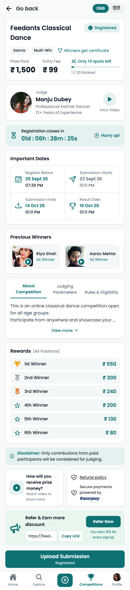
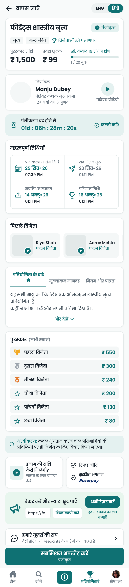
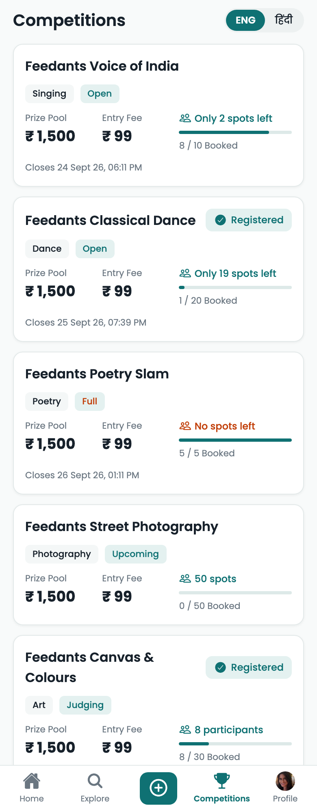
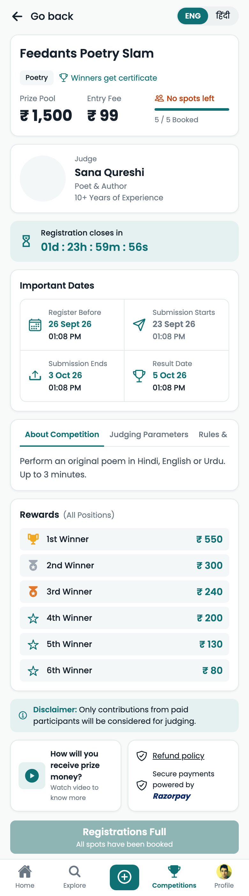
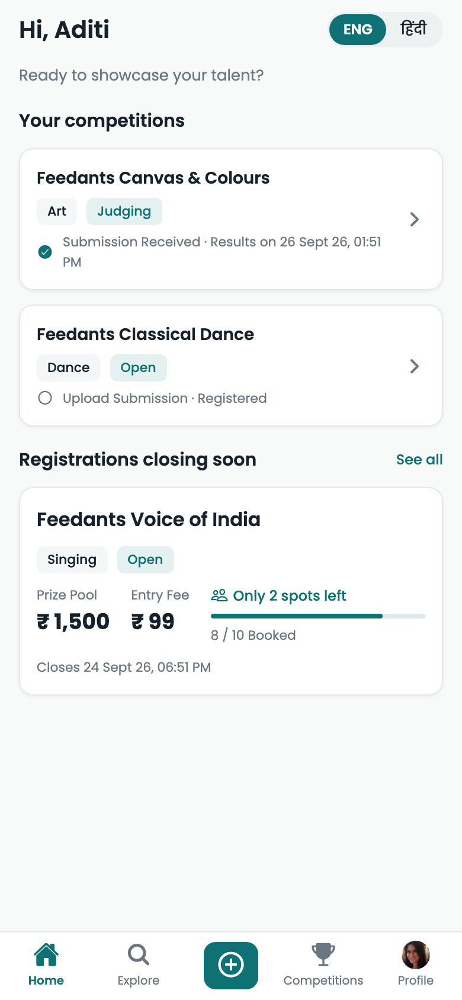
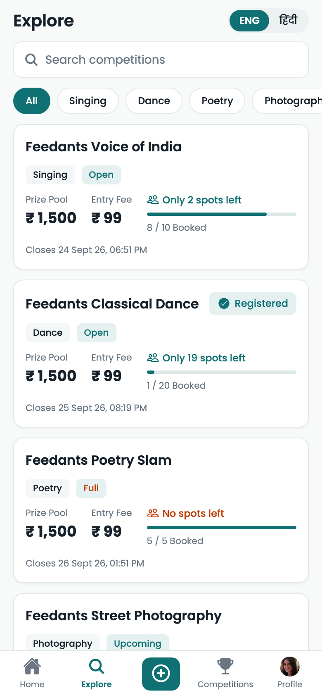
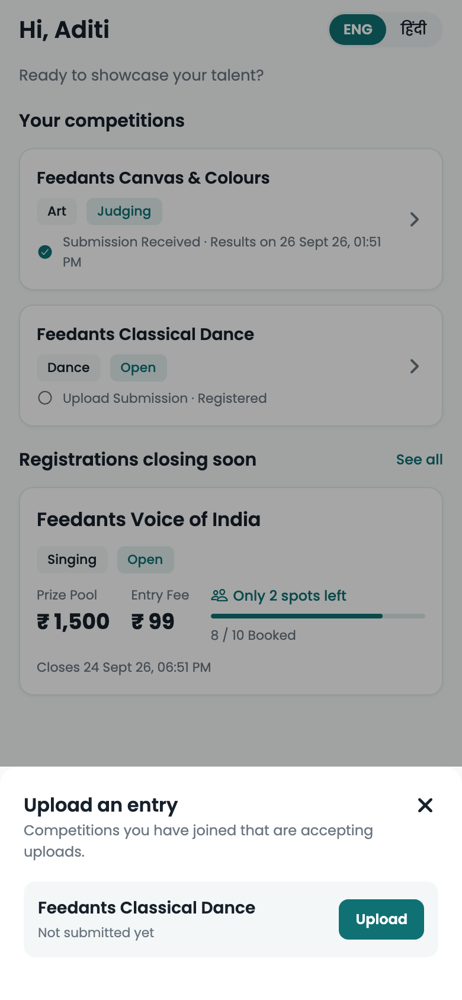
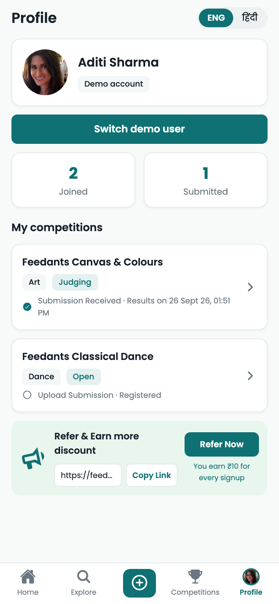

# Feedants: Competition Details

A working, full-stack version of the Feedants **Competition Details** screen, built with React Native (Expo), Node.js + Express, and MongoDB.

Everything on the screen comes from the API: prize pool, spots, dates, judge, winners, rewards, copy, the referral link, and testimonials. The page reacts to the competition's lifecycle and to the signed-in user. Registration is safe under concurrent load: spots can't be overbooked and a double tap can't register twice.

| Details (EN) | Details (हिंदी) | All states | Sold out |
|---|---|---|---|
|  |  |  |  |

The rest of the tab bar also works:

| Home | Explore | + Upload an entry | Profile |
|---|---|---|---|
|  |  |  |  |

```
backend/   Express API, Mongoose models, seed + demo scripts, tests
app/       Expo (React Native) app: iOS, Android and web
docker-compose.yml   MongoDB as a single-node replica set
```

---

## Running it

**Prerequisites:** Node 20.19+, and Docker *or* a local `mongod`. For the app, use Expo Go on a phone, an iOS/Android simulator, or a browser.

### 1. MongoDB (must be a replica set, because seat booking uses transactions)

```bash
docker compose up -d          # mongo:8 as replica set "rs0" on localhost:27017 (first boot takes ~10s to initiate)
```

Without Docker, run a local mongod as a single-node replica set instead:

```bash
mongod --replSet rs0 --port 27017 --dbpath ~/data/feedants
mongosh --eval 'rs.initiate({_id:"rs0",members:[{_id:0,host:"127.0.0.1:27017"}]})'
```

Port 27017 taken (for example by a standalone mongod)? Map another host port in `docker-compose.yml` (`"27018:27017"`) and use it in `MONGO_URL`. `directConnection=true` keeps the driver from following the replica-set member address. MongoDB Atlas (free tier) also works: use its connection string.

### 2. Backend

```bash
cd backend
cp .env.example .env
npm install
npm run seed      # resets the DB with demo data (dates are relative to "now")
npm run dev       # http://localhost:4000
npm test          # uses MONGO_URL_TEST, which is dropped on every run
```

### 3. App

```bash
cd app
npm install
npx expo start    # press i / a for a simulator, scan the QR code with Expo Go, or press w for web
```

The app calls the API on port 4000 of the machine running Expo, so web, simulators and Expo Go on the same Wi-Fi need no configuration. Set `EXPO_PUBLIC_API_URL` in `app/.env` if the API runs elsewhere.

### Environment variables

| Where | Variable | Default | Purpose |
|---|---|---|---|
| backend | `PORT` | `4000` | API port |
| backend | `MONGO_URL` | `mongodb://127.0.0.1:27017/feedants?directConnection=true` | Must point to a replica set (primary) |
| backend | `MONGO_URL_TEST` | `…/feedants_test?directConnection=true` | Test database (dropped on each run) |
| backend | `JWT_SECRET` | dev-only value | **Required** when `NODE_ENV=production` |
| backend | `ALLOW_DEMO_LOGIN` | `true` outside production | Enables `/api/auth/demo-*` |
| backend | `UPLOAD_DIR` | `./uploads` | Where submission videos are stored |
| backend | `MAX_UPLOAD_MB` | `200` | Upload size limit |
| backend | `PUBLIC_WEB_URL` | `https://feedants.com` | Base URL for referral links |
| app | `EXPO_PUBLIC_API_URL` | `http://<expo host>:4000` | API base URL |

---

## Demo guide

The seed creates three demo users and five competitions, each in a different state:

| Competition | State | What you'll see |
|---|---|---|
| Classical Dance | Registration open, submissions open | The design screen. Aditi is registered; other users can register |
| Voice of India | Closes in 5h, 2 spots left | "Hurry up!", registering takes a spot; uploads open later |
| Poetry Slam | Sold out | "No spots left", **Registrations Full** |
| Street Photography | Upcoming | "Registration opens in…" countdown |
| Canvas & Colours | Judging | "Results in…", **Submission Received** for entrants |

The app opens on **Home**: your competitions with their next step, plus competitions whose registration closes soon. **Competitions → Feedants Classical Dance** is the design screen.

Things to try:

- **Switch user:** go to **Profile → Switch demo user**. The app signs in as Aditi (registered) by default. Switch to Kabir or Meera to see the unregistered states.
- **Explore:** search by name, or filter by category.
- **+ button:** upload (or replace) an entry for any competition you've joined that is accepting submissions.
- **Register:** confirm the (mocked) ₹99 payment. The spot count, badge and button update immediately.
- **Upload:** pick a video. You can replace it until submissions close.
- **ENG / हिंदी:** switches the UI and the competition content, which is translated on the server with an English fallback.
- **Concurrency, live:** with the page open, run `npm run rush -- feedants-classical-dance 30` in `backend/`. This fires 30 simultaneous registrations. Exactly the remaining spots succeed, the rest get `COMPETITION_FULL`, and the open app shows the new count within one poll (≤15s).

---

## API

All responses are JSON. Errors look like `{ "error": { "code": "COMPETITION_FULL", "message": "…" } }`. Localized endpoints take `?lang=en|hi`.

| Method | Path | Auth | Description |
|---|---|---|---|
| GET | `/api/competitions` | optional | List with phase, spots, and `registered` for the caller |
| GET | `/api/competitions/:id` | optional | Details, `viewer` state (null when anonymous) and `serverTime` |
| POST | `/api/competitions/:id/registrations` | required | Book a spot. `201` returns the fresh details. `409` returns `REGISTRATION_CLOSED`, `COMPETITION_FULL` or `ALREADY_REGISTERED` |
| PUT | `/api/competitions/:id/submission` | required | Multipart `video` field. `403 NOT_REGISTERED`, `409 SUBMISSION_CLOSED`, `413 FILE_TOO_LARGE`, `415 INVALID_FILE` |
| GET | `/api/me` | required | Profile and referral link |
| GET | `/api/me/registrations` | required | My competitions with submission status (Home, Profile, + sheet) |
| GET | `/api/testimonials` | – | "Hear from our users" |
| GET | `/api/auth/demo-users`, POST `/api/auth/demo-login` | – | Demo-only sign-in (disabled in production) |
| GET | `/health` | – | Liveness plus DB connectivity |

Mutations return the same payload as `GET /:id`, so the app updates without a second round trip.

## Data model

- **competitions**: content (translatable fields are stored as `{ en, hi }`), `schedule` (5 dates, ordering validated), `rewards[]`, `previousWinners[]`, embedded `judge`, `capacity` and `bookedCount`. Winners, rewards and the judge are small and bounded, and are always read together, so they are embedded.
- **registrations**: one per (competition, user), enforced by a **unique index**. Holds the payment record and the submission's metadata. This is a separate collection because it grows without bound.
- **users**, **testimonials**.

Derived values are never stored: the **prize pool** is the sum of rewards, **spots left** is `capacity − bookedCount`, and the **phase** and **countdown** are computed from the schedule on each request. Nothing can go stale, and no cron job is needed to "open" or "close" a competition.

## How consistency works under concurrency

`services/competitions.js#register`:

1. **Fast-path checks** without a transaction: window open, not already registered, not full. Under a rush, most rejections end here cheaply.
2. **Transaction:**
   - A conditional `$inc` only matches while `bookedCount < capacity` and the registration window is open: `updateOne({ _id, status: 'published', window…, $expr: { $lt: ['$bookedCount', '$capacity'] } }, { $inc: { bookedCount: 1 } })`. This is a single-document atomic operation, so the counter can never pass capacity, however many requests race.
   - The registration insert is guarded by the unique index, so a double tap gets `ALREADY_REGISTERED` rather than a second row or a leaked seat.
   - Both writes commit together, so the counter and the registrations never disagree.

`test/competitions.test.js` fires 40 concurrent registrations at 5 spots (exactly 5 succeed) and 5 concurrent taps from one user (exactly 1 succeeds). It also covers closed windows, auth, language fallback, upload permissions, and the my-registrations endpoint.

On the client, poll responses can arrive after a newer mutation response. `useCompetition` tags each request and drops out-of-order ones, so a slow poll can't flip "Registered" back to "Register Now".

---

## Assumptions

- **One entry fee, paid at registration.** A registration is a paid seat. Payment is **mocked** as instantly captured (see production notes).
- **Registration and submission windows may overlap.** The design shows submissions opening before registration closes. The only rules are `registration opens < closes ≤ submission end ≤ result`, and `submission start < submission end`.
- **A seat is held from registration.** There is no waitlist, and withdrawals/refunds are out of scope (the refund policy text comes from the DB).
- **Submissions are replaceable** until the window closes. The latest upload wins and the old file is deleted.
- **Auth is out of scope.** A demo sign-in issues real JWTs for seeded users, so the backend's auth path is the production one.
- **Home, Explore, + and Profile are lightweight companions** to the details screen. They reuse the same APIs and components. Explore filters the (capped) competition list on the device. The "Ad Here" slot is still a placeholder.
- **Referral link and reward amount** are served per user. Crediting a referral belongs to the sign-up flow, which doesn't exist here.
- **Times display in the device's timezone.** The countdown corrects for a wrong device clock using `serverTime` from the API.

## Technical decisions

- **Expo (managed)** so reviewers can run it on a phone, simulator or browser with no native setup. It's still React Native, with React Navigation's native stack.
- **The server owns the rules and the phase; the client owns presentation.** `lib/cta.ts` is a pure function mapping (phase × viewer state) to the bottom button. The server rejects anything it shouldn't allow regardless.
- **The countdown ticks inside its own component**, so only that component re-renders each second. When it hits zero it triggers a refetch, which moves the phase and the button forward.
- **Polling (15s, paused in the background, refetch on focus and on foreground)** keeps spots fresh with plain HTTP. Responses are small and ETag'd by Express.
- **Transactions + a conditional `$inc` + a unique index** give three layers of protection, each covering a different failure mode (see above).
- **Videos upload through Expo's native uploader on devices**, which streams the file from disk. `fetch` + `FormData` loads the whole file into memory and failed outright for iPhone videos. The app also checks the size before sending; the limit comes from the API.
- **Validate before accepting the upload.** Registration and window checks run before multer touches the disk, so rejected requests never write files.
- **Per-user write rate limit** (keyed after auth) rather than per-IP, because mobile carriers put many users behind one IP.
- **No global state library.** A small session context (user, language) and a data hook per screen cover this module. Lists refetch whenever their screen comes into focus, so an action on one tab shows up on the others.
- **The tab bar matches the design** by passing the custom component to React Navigation's bottom-tab navigator. The details screen sits above the tabs on a stack and renders the same bar.
- **Localized content lives in the DB** as `{ en, hi }` and is resolved server-side with an English fallback. UI strings live in `app/src/i18n.ts`.

## Trade-offs

- **Polling instead of pushes.** It's simpler and stateless, and scales horizontally behind a load balancer. The cost is up to 15s of staleness for spot counts. The server re-checks at write time, so staleness never causes an overbooking. At worst a user sees "Registrations Full" only after tapping.
- **Transactions require a replica set.** That's slightly more local setup (hence docker-compose), in exchange for the seat counter and the registrations never drifting apart.
- **A counter on the competition document** is a write hotspot under extreme contention for a single competition. That's fine at thousands of users. At much larger scale, shard the counter or use a Redis reservation in front.
- **Mocked payments** keep the demo self-contained, but a real flow needs a seat-hold state (below).
- **Files on local disk** keep it runnable anywhere, but don't work with more than one API instance.

## What I'd do next for production

1. **Real payments (Razorpay):** a registration starts `pending` with a short seat hold (TTL), the client checks out, and the verified webhook confirms it idempotently. Expired holds release the seat, and refunds follow the policy.
2. **Uploads straight to object storage** (S3/GCS pre-signed URLs), with a transcoding and moderation pipeline. The API would only record the object key.
3. **Real auth** (phone OTP), tokens in SecureStore, and refresh tokens.
4. **Push updates** (SSE/WebSocket, or a CDN-cached availability endpoint) if staleness matters, plus a waitlist when a competition is full.
5. **Redis** for the rate-limit store and hot-read caching. Structured logging, request IDs, metrics and alerting.
6. **Schema validation at the edge** (zod/celebrate), an OpenAPI spec, and a shared types package between app and API.
7. **Admin tooling** to create competitions (schedule validation already exists in the model) and to publish results, which would feed "Previous Winners" automatically.
8. **Client tests** (Jest + React Native Testing Library for `getCta` and the screen states), an E2E suite (Detox/Maestro), and CI.
9. **Accessibility pass** on real devices (screen reader order, dynamic type), and deep links (`feedants.com/r/<code>`, `/competitions/<slug>`).
